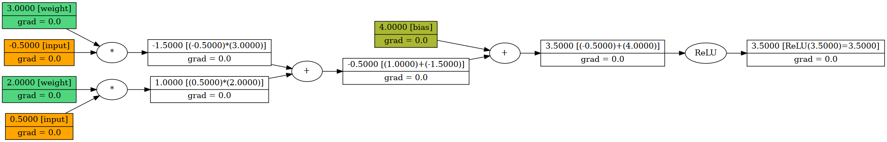
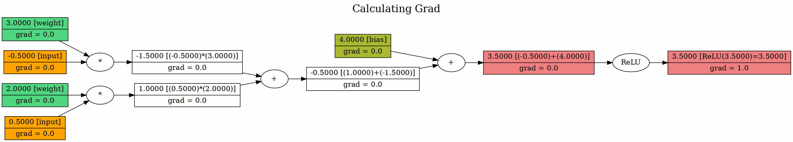
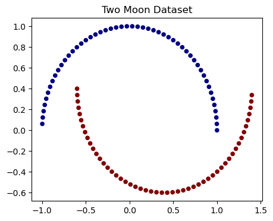
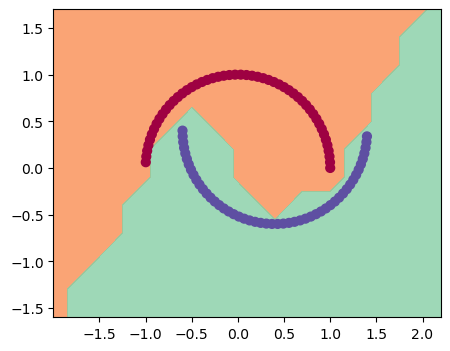

# mGardPlus

This project is a scalar autograd engine that implements backpropagation (backward propagation) over a dynamically built Directed Acyclic Graph (DAG).  
It is built completely from scratch using pure Python, with no deep learning frameworks or libraries, not even NumPy.  
This project is heavily inspired by the [micrograd](https://github.com/karpathy/micrograd) repository by Andrej Karpathy.

## Features

- **Dynamically Built DAG**: Constructs the computation graph dynamically during execution.
- **Detailed Representations**: Provides more detailed visualizations of the computation graph.
- **Backpropagation Animation**: Can animate the backpropagation process to help understand it better.
- **Save Animations**: Allows saving animations as GIF files.
- **Mathematical Explanations**: Includes explanations for the underlying math.

## Example

All the necessary classes are defined in `mGardPlus.ipynb`  
Therefore, there's no need to import anything.  
The ideal use case is downloading the notebook and `writing/testing/playing` from the bottom of the notebook.

Let's create a simple neuron using the Node class:

```python
# Example creating a basic neuron
# Which takes 2 inputs and has 2 weights and 1 bias with ReLU activation function

x1 = Node(0.5, "input")
x2 = Node(-0.5, "input")
w1 = Node(2, "weight")
w2 = Node(3, "weight")
b = Node(4, "bias")
n = (x1 * w1 + x2 * w2 + b).relu()  # Here n is considered as a single neuron

n.backward()

print(f"grad of w1: {w1._grad}, w2: {w2._grad}, b: {b._grad}")
n.draw_graph(high_dp=True)  # Generates a color-coded graph
```

The output of the above code will be:

```output
grad of w1: 0.5, w2: -0.5, b: 1
```



<br>

If we want to view the process of how the gradients are calculated, we can use:

```python
n.backward(animate=True, animation_delay=0.3)
```



## Binary Classification Using Multi-Layer Perceptron of mGardPlus

In the notebook, an MLP (Multi-Layer Perceptron) is created for demonstration purposes.  
Read the relevant section for an in-depth understanding.  
The dataset used is called 'make_moons', which creates coordinates (x, y) for two interleaving half circles along with labels for each coordinate.

Plot of the dataset:



And the decision boundary learned by the model:

